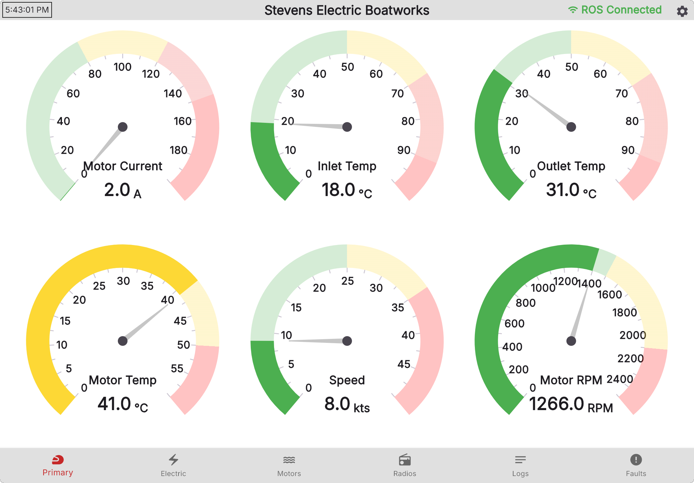

# Waterboard
 

**Waterboard** is the custom-built driver dashboard deployed on the **Manned Boat**, developed using Flutter. 
The main goal of this Dashboard is to be the primary source of information for the Driver, and everything, from the color scheme, to the layout of components is optimized for high readability.


It also contains a "display mode" under Settings to show information about the team and software, in a format optimized for the boat.

## Building from Source
Dependencies:
* The ROS based [manned boat](https://github.com/Stevens-Electric-Boatworks/manned-boat) software
* [ROSBridge](https://github.com/RobotWebTools/rosbridge_suite)
* [Flutter](https://flutter.dev/)

To get started, install [Flutter](https://flutter.dev). 

Then, download all the packaegs needed:
```bash
flutter pub get
```
Finally, build the application for Windows:
```bash
flutter build windows
```

The final dashboard will be located in `build\windows\x64\runner\Release`.

> [!NOTE]
> Instructions for cross-compiling for Raspberry Pi are coming soon!

--------


[Website](https://stevenseboat.org/) | [Support Us :heart:](https://stevenseboat.org/support-us) | [Instagram](https://www.instagram.com/stevenseboat/) | [LinkedIn](https://www.linkedin.com/company/stevenseboat/) | [Join Us!](https://ducklink.stevens.edu/sname/home/)
