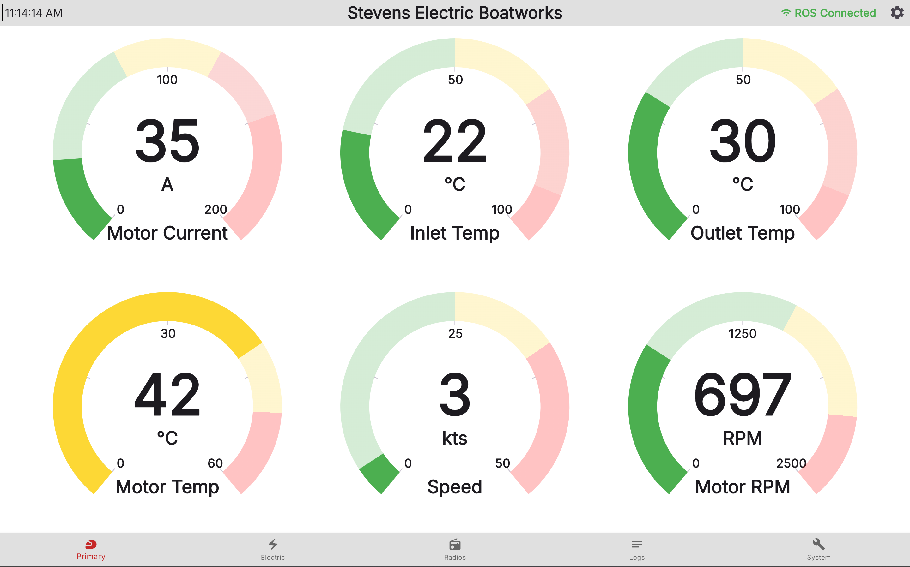

# Waterboard
<p align="center">
	 
</p>


[](https://github.com/Stevens-Electric-Boatworks/waterboard/actions/workflows/main.yml)

> [!TIP]
> Try out the [experimental web version](https://stevens-electric-boatworks.github.io/waterboard/) of this dashboard, which follows the latest changes made to the repo on _ANY_ branch.

**Waterboard** is the custom-built driver dashboard deployed on the **Manned Boat**, developed using Flutter. The main goal of this Dashboard is to be the primary source of information for the Driver, and everything, from the color scheme, to the layout of components is optimized for high readability. It is also a debugging and control panel for the Control System Team, providing tools to help debug connection issues from both Waterboard and ROS.
# Features
* Display vital control system information for the driver and technicans
* View information about WiFi, GPS, and Satellites
* Logs viewer for ROS, ROSBridge, and Waterboard with optional filtering
* View system diagonistics (CPU %, RAM usage, disk space, network tx/rx), and reboot/shutdown host system
* Connection status dialogs
* Standby Mode with a slideshow
* Keyboard, Touch, and Mouse Navigation Support
* Lockable Layout
* Unit tested with CI/CD builds published regularly 
* _**The Dashboard [can run Doom](https://github.com/Stevens-Electric-Boatworks/waterboard/tree/doom)**_
# Downloading Pre-Built Binaries

You can download the latest version of Waterboard from the latest CI build on [GitHub Actions](https://github.com/Stevens-Electric-Boatworks/waterboard/actions). Note that you must be logged into GitHub to download. The following platforms are provided:
* ⭐ Raspberry Pi 4B using [FlutterPi](https://github.com/ardera/flutter-pi)
	* This version is the one deployed on the Manned Boat  
* ⭐ Windows
* Web (`Experimental`)
	* *Note*: This version does not have support for tracking CPU usage, RAM, or system power controls. You must allow unsecure connections in your browser to connect to remote ROSBridge websockets.
 	* We have a web version predeployed located [here](https://stevens-electric-boatworks.github.io/waterboard)! It follows the latest changes made to this repo. 
* Linux Desktop
* MacOS (`Experimental`)


The application has been designed to adapt to any screen size, however, the priority is to look best on the boat screen. Therefore, super-small or super huge resolutions may not look too small/too big.

# Building from Source

Dependencies:
* [Flutter](https://flutter.dev/)
* The [ROS](https://www.ros.org/) based [manned boat](https://github.com/Stevens-Electric-Boatworks/manned-boat) software
	* Only needed to get data from Waterboard, not needed to simply run the Dashboard
* [ROSBridge](https://github.com/RobotWebTools/rosbridge_suite)
	* Only needed to get data from Waterboard, not needed to simply run the Dashboard

To get started, install [Flutter](https://flutter.dev). 

Then, download all the packages needed:
```bash
flutter pub get
```

Finally, build the application for your platform:
```bash
flutter build [PLATFORM=windows,linux,macos,web]
```

Example:

```bash
flutter build windows
```

The final dashboard will be located in `build\[PLATFORM]\x64\runner\Release`.

## Building for Raspberry Pi

> [!NOTE]
> These instructions for building for Raspberry Pi require you to be on a Linux system (does not need to be ARM). WSL Ubuntu does work, and the GitHub actions runner use Ubuntu 24.04.

To get started, install [Flutter for Linux](https://docs.flutter.dev/install/quick)

> [!IMPORTANT]
> Due to [a bug](https://github.com/ardera/flutterpi_tool/issues/87) in `flutterpi_tool`, it may fail to compile when using the latest version of Flutter. The recommended version is **v3.38.9**.

Then, download the required dependencies: 
```bash
sudo apt-get update -y && sudo apt-get upgrade -y
sudo apt-get install -y clang cmake ninja-build pkg-config libgtk-3-dev libstdc++-12-dev
```

Then, install Waterboard dependencies: 
```bash
flutter pub get
```

Now, install [FlutterPi](https://github.com/ardera/flutter-pi) by using `flutterpi_tool`:
```bash
flutter pub global activate flutterpi_tool
```

Now its time to build for Raspberry Pi:
```bash
flutterpi_tool build --arch=arm64 --cpu=pi4 --release
```

The final build application will be located in `build/flutter-pi/pi4-64`. You can now move the contents of the entire folder to the Raspberry Pi. 

# Running the Application

> [!IMPORTANT]
> **IF you are on Windows or Raspberry Pi**, you must download the required dependency for the system utilization daemon. Run:
> ```bash
> pip install --break-system-packages psutil
> ```
> Failure to install it will result in the system util daemon not starting.


Run the Waterboard executable on the platform of your choice. 
## Running on Raspberry Pi

To run on Raspberry Pi, ensure that all contents are copied onto the Raspberry Pi. Then run: 
```bash
chmod +x flutter-pi
sudo ./flutter-pi --release # this will run the application, a display server is NOT needed
```

Running as `root` is important in order to have proper keyboard and mouse support enabled. 


Now, run ROSBridge in a sourced workspace. By default, ROSBridge runs on `*:9090`, which Waterboard has set as its defaults. Once running, you can run the [manned boat software](https://github.com/Stevens-Electric-Boatworks/manned-boat) using the documentation provided on the wiki.

# Contact

Ishaan Sayal - [isayal@stevens.edu](mailto:isayal@stevens.edu)

--------


[Website](https://stevenseboat.org/) | [Support Us :heart:](https://stevenseboat.org/support-us) | [Instagram](https://www.instagram.com/stevenseboat/) | [LinkedIn](https://www.linkedin.com/company/stevenseboat/) | [Join Us!](https://ducklink.stevens.edu/sname/home/)
